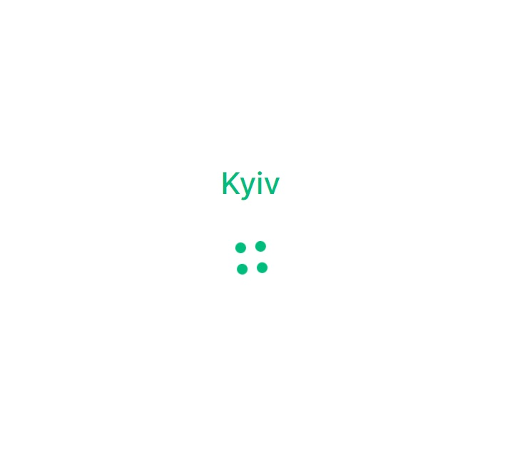
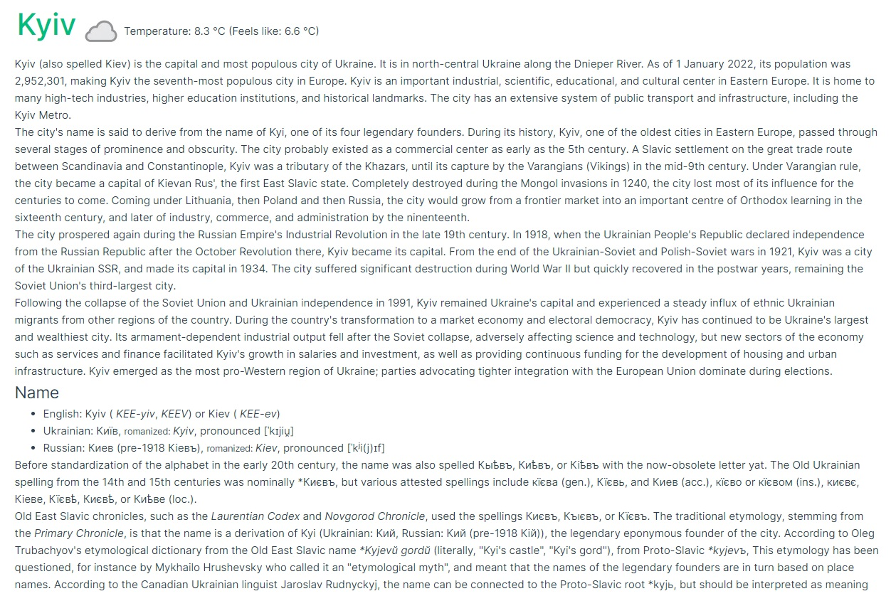

# City Page

Build a simple city page using Vue.js 3, TS and fetching data from open api:  
`http://api.weatherapi.com/v1/current.json?key=${APIKey}&q=${city}`  
`https://en.wikipedia.org/w/api.php?action=query&titles=${city}&prop=extracts&exlimit=max&format=json`  
For `weatherapi` request you will need an apiKey, it could be issued on the [https://www.weatherapi.com/docs/](https://www.weatherapi.com/docs/)  
It's free, no credit card needed

## Tech requirements

Node version 20.10.0
Yarn version ^1.22.15

## Requirements

- The loader should be displayed while data is fetching
- Data should be fetched from api, not from JSON-files
- Simple weather info should be displayed in header
- Info from wikipedia should be displayed bellow
- Upload your solution on `github/gitlab`
- Use `.env.local` file to keep your `VITE_WEATHER_API_KEY` (no need to push it on the `github/gitlab`)

# Bonus

- Cover functionality with unit tests

## Example of Finished App

This is an example of what the page should look like.

